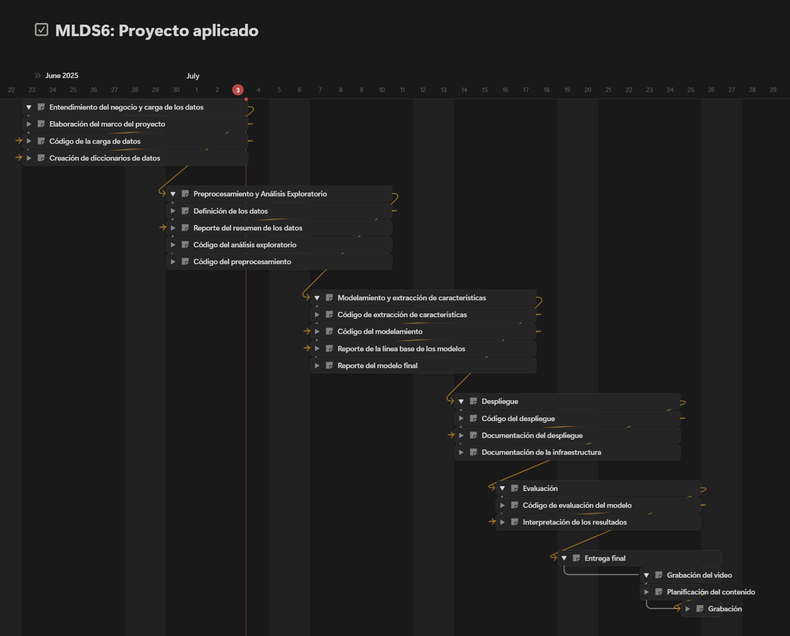

# Project Charter - Entendimiento del Negocio

## Nombre del Proyecto

**Predicción del Precio de Viviendas con Machine Learning**

## Objetivo del Proyecto

Desarrollar un sistema predictivo que estime el precio de venta de una vivienda a partir de sus características físicas, antigüedad y de localización, con el fin de asistir a agentes inmobiliarios y portales de compra-venta en las valoraciones de inmuebles de una manera rápida y consistentes, optimizando el proceso de cotización y negociación.

## Alcance del Proyecto

### Incluye:

Para el desarrollo de este proyecto se utilizará el conjunto de datos [House Sales in King County, USA](https://www.kaggle.com/datasets/harlfoxem/housesalesprediction/data), el cuál incluye información sobre la estructura, localización y precio de venta. Los registros de ventas están entre mayo del 2014 y mayo del 2015 (ver [diccionario de datos](../data/data_dictionary.md)).

El modelo será capaz de predecir el precio estimado de una propiedad con base en sus atributos. Una FastAPI que permita enviar los datos de una casa y se obtenga la predicción. Para esto se usarán herramientas de versionamiento de código (Git/GitHub), versionamiento de datos (DVC), seguimiento de experimentos (MLflow) y documentación del proyecto.

Los criterios de éxito incluyen los siguientes:

- Alcanzar un error promedio absoluto (**MAE**) menor a $55000, lo que representa aproximadamente un 10% del valor promedio del mercado.
- Control de versiones y reproducibilidad con Git, DVC y MLflow.
- Reducir el tiempo estimado para la cotización de propiedades.

### Excluye:

- Incorporación de fuentes externas de datos en tiempo real y, con esto, optimización de estrategias de precios dinámicos.

## Metodología

Se seguirá la metodología **TDSP (Team Data Science Process)**, dividiendo el trabajo en entregables semanales, así:

- Entendimiento del negocio y carga de datos
- Preprocesamiento y análisis exploratorio
- Modelamiento y experimentación
- Despliegue
- Evaluación y entrega final

## Cronograma

## Equipo del Proyecto

- Laura Alejandra Díaz López
- Nikolás Santacruz Mejía

## Presupuesto

El proyecto se desarrolla localmente, usando equipos personales y herramientas open source, por lo que no requiere inversión adicional.

## Stakeholders

- **Gerente de operaciones inmobiliarias:** responsables de la estrategia de ventas y necesitan herramientas que optimicen la fijación de precios y agilicen los tiempos de cotización para mejorar la tasa de cierre de negocios.
  - **_Expecativa:_** que el modelo sea confiable y permita obtener estimaciones rápidas del valor de una propiedad, facilitando negociaciones con clientes y justificando precios sugeridos con datos históricos.
- **Equipo de tecnología:** serán quienes mantendrán el modelo en producción, integrarán el API en los sistemas existentes y supervisarán el versionamiento de datos y modelos.
  - **_Expecativa:_** que el proyecto siga buenas prácticas de desarrollo (como el uso de herramientas de versionamiento).
- **Agentes inmobiliarios:** usarán directamente el sistema para obtener estimaciones rápidas del costo de viviendas. 
  - **_Expecativa:_** que el sistema sea fácil de usar y rápido.

## Aprobaciones

| Nombre y cargo del aprobador del proyecto       | Firma                      | Fecha de aprobación |
|:----------:|:----------:|:----------:|
| _____________________________________________________ | _____________________________ | ___ / ___ /______        |
