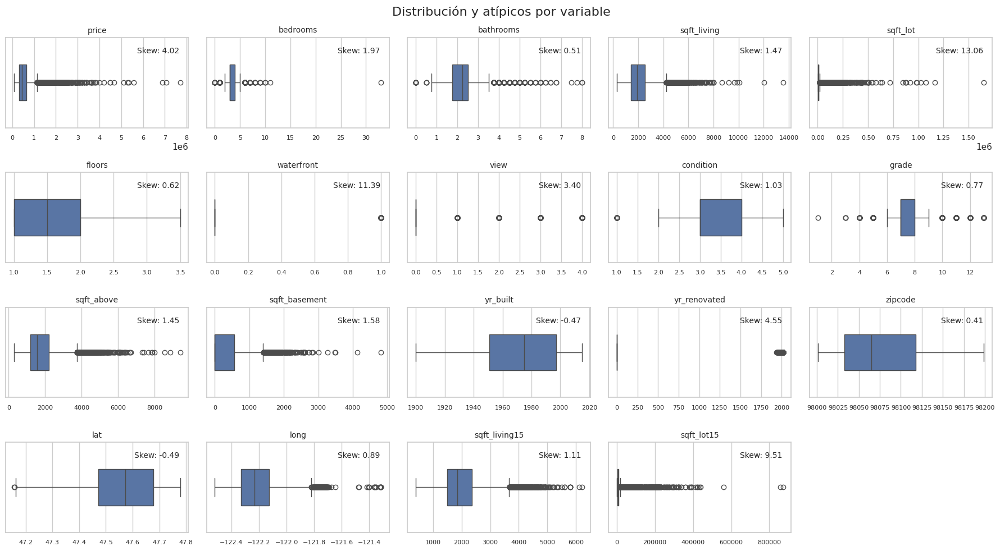
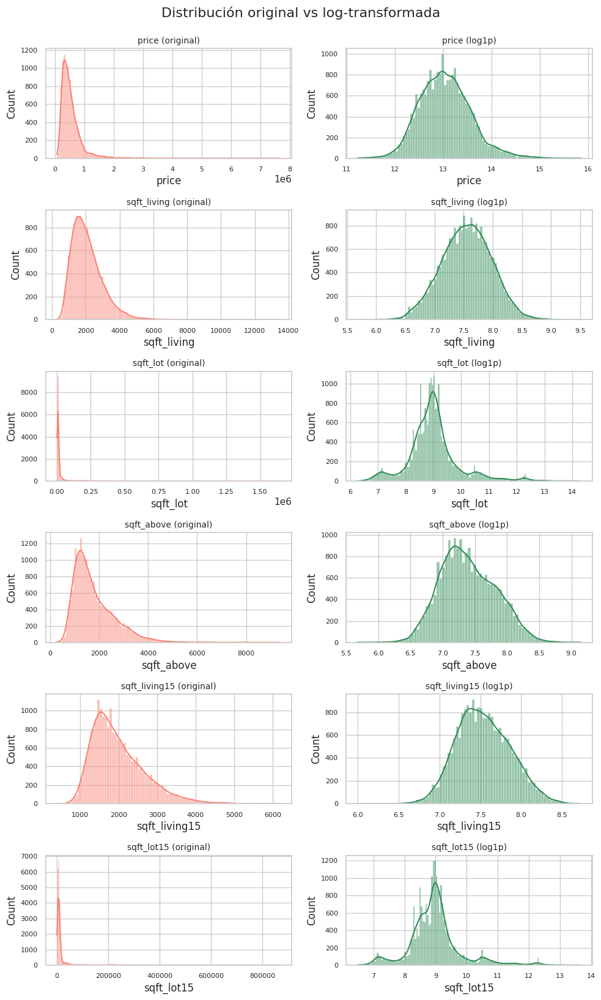

# Reporte de Datos

Este documento contiene los resultados del análisis exploratorio de datos.

## Resumen general de los datos

Se cuenta con 21 columnas y 21613 filas, estos datos son de ventas de viviendas en la ciudad de seattle USA, todos estos datos a excepción de la fecha, la cual esta en datetime, son numericos. Las variables que más afectan el precio de venta son el numero de habitaciones, baños y metros cuadrados, las demas variables tienen baja correlación. Finalmente no se cuenta con valores faltantes en el dataset.

## Resumen de calidad de los datos

El dataset no tiene valores nulos o faltantes, por lo que no se tendra que imputar o aplicar tecnicas de llenado, por otro lado si se encontrarón valores atipicos en la columna de precio ya que la mayor parte de la distribución esta en un rango similar de precio, esto probablemente sea por la ubicación geografica de la vivienda ya que los factores sociales pueden influir, este preprocesamiento se tratara en su script correspondiente.

## Variable objetivo

La variable objetivo es el precio de las casas, como se menciono anteriormente la grafica tiene una distribución donde la mayor parte de los datos se concentran en la parte izquierda del grafico.

Por otro lado se grafico la tendencia del precio a lo largo del tiempo de acuerdo a la fecha de construcción de la vivienda y la fecha de venta de esta, y se obtuvo una grafica con rango de precios muy cercanos entre sí.

## Variables individuales

A continuación se presenta un resumen estadístico de las variables numéricas del conjunto de datos:

|               | mean    | std           | min          | 25%           | 50%           | 75%           | max           | count         |
| ------------- | ------- | ------------- | ------------ | ------------- | ------------- | ------------- | ------------- | ------------- |
| id            | 21613.0 | 4.580302e+09  | 2.876566e+09 | 1.000102e+06  | 2.123049e+09  | 3.904930e+09  | 7.308900e+09  | 9.900000e+09  |
| price         | 21613.0 | 5.400881e+05  | 3.671272e+05 | 7.500000e+04  | 3.219500e+05  | 4.500000e+05  | 6.450000e+05  | 7.700000e+06  |
| bedrooms      | 21613.0 | 3.370842e+00  | 9.300618e-01 | 0.000000e+00  | 3.000000e+00  | 3.000000e+00  | 4.000000e+00  | 3.300000e+01  |
| bathrooms     | 21613.0 | 2.114757e+00  | 7.701632e-01 | 0.000000e+00  | 1.750000e+00  | 2.250000e+00  | 2.500000e+00  | 8.000000e+00  |
| sqft_living   | 21613.0 | 2.079900e+03  | 9.184409e+02 | 2.900000e+02  | 1.427000e+03  | 1.910000e+03  | 2.550000e+03  | 1.354000e+04  |
| sqft_lot      | 21613.0 | 1.510697e+04  | 4.142051e+04 | 5.200000e+02  | 5.040000e+03  | 7.618000e+03  | 1.068800e+04  | 1.651359e+06  |
| floors        | 21613.0 | 1.494309e+00  | 5.399889e-01 | 1.000000e+00  | 1.000000e+00  | 1.500000e+00  | 2.000000e+00  | 3.500000e+00  |
| waterfront    | 21613.0 | 7.541757e-03  | 8.651720e-02 | 0.000000e+00  | 0.000000e+00  | 0.000000e+00  | 0.000000e+00  | 1.000000e+00  |
| view          | 21613.0 | 2.343034e-01  | 7.663176e-01 | 0.000000e+00  | 0.000000e+00  | 0.000000e+00  | 0.000000e+00  | 4.000000e+00  |
| condition     | 21613.0 | 3.409430e+00  | 6.507430e-01 | 1.000000e+00  | 3.000000e+00  | 3.000000e+00  | 4.000000e+00  | 5.000000e+00  |
| grade         | 21613.0 | 7.656873e+00  | 1.175459e+00 | 1.000000e+00  | 7.000000e+00  | 7.000000e+00  | 8.000000e+00  | 1.300000e+01  |
| sqft_above    | 21613.0 | 1.788391e+03  | 8.280910e+02 | 2.900000e+02  | 1.190000e+03  | 1.560000e+03  | 2.210000e+03  | 9.410000e+03  |
| sqft_basement | 21613.0 | 2.915090e+02  | 4.425750e+02 | 0.000000e+00  | 0.000000e+00  | 0.000000e+00  | 5.600000e+02  | 4.820000e+03  |
| yr_built      | 21613.0 | 1.971005e+03  | 2.937341e+01 | 1.900000e+03  | 1.951000e+03  | 1.975000e+03  | 1.997000e+03  | 2.015000e+03  |
| yr_renovated  | 21613.0 | 8.440226e+01  | 4.016792e+02 | 0.000000e+00  | 0.000000e+00  | 0.000000e+00  | 0.000000e+00  | 2.015000e+03  |
| zipcode       | 21613.0 | 9.807794e+04  | 5.350503e+01 | 9.800100e+04  | 9.803300e+04  | 9.806500e+04  | 9.811800e+04  | 9.819900e+04  |
| lat           | 21613.0 | 4.756005e+01  | 1.385637e-01 | 4.715590e+01  | 4.747100e+01  | 4.757180e+01  | 4.767800e+01  | 4.777760e+01  |
| long          | 21613.0 | -1.222139e+02 | 1.408283e-01 | -1.225190e+02 | -1.223280e+02 | -1.222300e+02 | -1.221250e+02 | -1.213150e+02 |
| sqft_living15 | 21613.0 | 1.986552e+03  | 6.853913e+02 | 3.990000e+02  | 1.490000e+03  | 1.840000e+03  | 2.360000e+03  | 6.210000e+03  |
| sqft_lot15    | 21613.0 | 1.276846e+04  | 2.730418e+04 | 6.510000e+02  | 5.100000e+03  | 7.620000e+03  | 1.008300e+04  | 8.712000e+05  |

Para explorar la distribución y detectar valores atípicos, se generaron diagramas de caja para todas las variables numéricas del conjunto de datos. Además, se incluyó el valor de asimetría (skewness) en cada gráfico para facilitar su interpretación.

- Varias variables presentan una alta asimetría positiva, lo cual puede afectar modelos que asumen normalidad (como la regresión lineal). Entre las más destacadas están: `price`, `sqft_lot`, `sqft_lot15`, `view` y `waterfront`.

- Las variables `sqft_living`, `sqft_above` y `sqft_living15` también muestran una asimetría moderada-alta, aunque menor en comparación con las anteriores.

- Outliers extremos son recurrentes en variables continuas como `price`, `sqft_lot` y `sqft_basement`. Algunos puntos son claramente atípicos (propiedades con más de 30 habitaciones) e valores no acordes con la realidad (viviendas con 0 baños o 0 habitaciones).

- Variables como `yr_renovated` y `sqft_basement` muestran una gran concentración en cero, lo que justifica binarizarlas ya que el valor positivo implica simplemente la existencia del evento, no una distribución informativa continua.

- `view`, `waterfront` y `condition` tienen valores discretos escasos o dominados por una categoría.

En la siguiente imagen comparamos las distribuciones originales de las variables `price`, `sqft_living`, `sqft_lot`, `sqft_above`, `sqft_living15` y `sqft_lot15`, con sus respectivas transformaciones logarítmicas utilizando `np.log1p()`.

- Podemos observar que la transformación logarítmica (`np.log1p`) aplicada a estas variables reduce considerablemente la asimetría, acercando sus distribuciones a una forma simétrica y en algunos casos normal.

- La mejora es más evidente en variables con una fuerte asimetría inicial (`sqft_lot`, `sqft_lot15`, `price`), cuyas colas largas se acortan y los histogramas se aproximan a una forma simétrica.

La siguiente figura corresponde a una matriz de correlación entre todas las variables del dataset, en esta se puede ver que las columnas que más afectan la variable objetivo son el numero de habitaciones, baños y el area.

Existen relaciones entre otras variables debido a que son de naturaleza similar, como lo podria ser el area construida y el area del sotano o azotea.

## Ranking de variables

Las variables más importantes en la predicción del precio de venta son:

1. Area construida
2. Numero de baños
3. Numero de Habitaciones

## Relación entre variables explicativas y variable objetivo

Como se puede ver en el anterior grafico, a medida que aumentamos el area o el numero de habitaciones/baños el precio tiende a aumentar, esta tendencia se ve fuertemente aplicada con el area donde se visualiza claramente como este precio aumenta muy cercano a una tendencia lineal.

