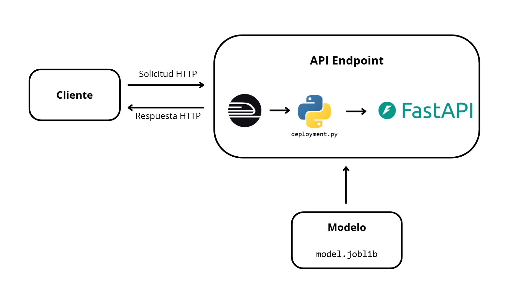

# Despliegue de modelos

## Infraestructura

- **Nombre del modelo:** Predictor del precio de viviendas en King County. Guardado como `model.joblib`. En MLflow como `XGBRegressor_Final`.
- **Plataforma de despliegue:** Se usa Railway como plataforma para desplegar nuestra aplicación de FastAPI.
- **Requisitos técnicos:** 
  - Python 3.12.3
  - Librerías necesarias: 

  ```
  scikit-learn==1.7.0
  fastapi==0.116.1
  uvicorn==0.35.0
  xgboost==3.0.2
  numpy==2.3.1
  pandas==2.3.1
  joblib==1.5.1
  ```

- **Requisitos de seguridad:** no se implementaron mecanismos específicos de seguridad (omitiendo autenticación, autorización o cifrado de datos).
- **Diagrama de arquitectura:**
  
  

## Código de despliegue

- **Archivo principal:** [deployment.py](../../scripts/deployment/deployment.py)

  Este script implementa una API con FastAPI para predecir el precio de una vivienda a partir de sus características. Utiliza **Pydantic** para validar la entrada (`ApiInput`) y estructurar la salida (`ApiOutput`). El modelo, previamente entrenado y exportado con la librería `joblib`, se carga al iniciar. Al recibir una solicitud `POST` en `/house_price`, los datos se convierten en un DataFrame, se predice el logaritmo del precio y se aplica `np.expm1` para obtener el valor original, que se devuelve como respuesta.


- **Rutas de acceso a los archivos:** 
  - [scripts/deployment/deployment.py](../../scripts/deployment/deployment.py)
  - [requirements.txt](../../requirements.txt)
  - [railway.json](../../railway.json)
  - [src/model.joblib](../../src/model.joblib)

- **Variables de entorno:** No se usó ninguna variable de entorno.

## Documentación del despliegue

- **Instrucciones de instalación:** 

  Una vez creados los archivos necesarios para el despliegue mencionados en la sección anterior (`deployment.py`, `requirements.txt`, `railway.json` y `model.joblib`), se realizó una prueba local desde la terminal utilizando el siguiente comando:
  ```
  uvicorn --app-dir scripts/deployment/ deployment:app --reload
  ```

  Para desplegar en la plataforma Railway, luego de crear una cuenta, se siguieron los siguientes pasos:

  - Seleccionar **"New Project"** y luego **"Deploy from GitHub repo"**.

  - Elegir el repositorio correspondiente.

- **Instrucciones de configuración:**
  - Una vez completado el despliegue, acceder a la sección **"Settings"** del proyecto y, dentro del apartado **"Networking"**, seleccionar **"Generate Domain"**. Esto genera una URL pública a través de la cual se puede acceder a la API desde cualquier navegador o cliente HTTP. En nuestro caso, la URL generada fue: https://mlds6-production-0dfb.up.railway.app.

- **Instrucciones de uso:** 
  - Acceder a https://mlds6-production-0dfb.up.railway.app/docs
  - Buscar el endpoint `POST /house_price`.
  - Hacer clic en **"Try it out"**.
  - Ingresar los valores requeridos por el modelo en el formulario (ver [test.py](../../scripts/deployment/test.py) para un ejemplo de la estructura de entrada).
   - Hacer clic en **"Execute"**. Esto devolverá la predicción del modelo según los valores de entrada proporcionados.

  > Alternativamente, se puede realizar la solicitud mediante un script en Python utilizando la librería `requests`, apuntando al endpoint `/house_price` ([test.py](../../scripts/deployment/test.py) contiene un ejemplo de esto).

- **Instrucciones de mantenimiento:**
  
  **1. Actualización del modelo entrenado:**
    - Reentrenar el modelo localmente con nuevos datos si es necesario (se recomienda actualizar el modelo cada 2 a 6 meses, dependiendo de la variabilidad de los datos disponibles).
    - Exportar el nuevo modelo con `joblib.dump()` en la misma ruta (`model.joblib`).
    - Verificar el funcionamiento de la API ejecutando localmente:
      ```
      uvicorn --app-dir scripts/deployment/ deployment:app --reload
      ```
  **2. Subida de cambios a GitHub:**
    - Utilizar los siguientes comandos para registrar y enviar los cambios realizados al repositorio remoto:
      ```
      git add src/model.joblib
      git commit -m "Retrained prediction model"
      git push origin master
      ```
      > Railway detectará automáticamente el cambio y volverá a desplegar la aplicación.

  **Consideraciones importantes:**
    - Reentrenar cada 2 a 6 meses, según la evolución del mercado (inflación, urbanismo, etc.).
    - Comparar predicciones con precios reales recientes para detectar desviaciones (drift) y decidir si se requiere un nuevo entrenamiento.
    - Se recomienda usar MLflow para gestionar experimentos, métricas, artefactos y facilitar el seguimiento del ciclo de vida del modelo.
    - Antes del despliegue es importante verificar que `model.joblib` cargue sin errores, que `/house_price` funcione correctamente y que `/docs` refleje la estructura de entrada esperada.

